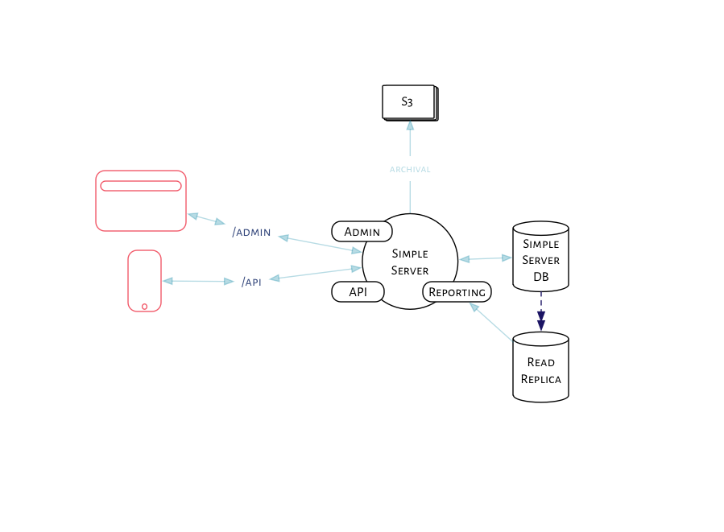

# Reporting

## Context

Once we have the data, we need a way to analyze it, and derive meaningful data from it.
Nurses, medical officers, officials from Resolve and IHMI, and admins on Simple
will want to view vital information to track control of hypertension and adoption of the app.

### Kinds of reports
1. Admin/Web reports
    - Admins, CVHOs, STSes, and officials on Simple that have access to the admin dashboard see these reports.
    - They provide analyis of adoption, and usage of the app.
    - They also provide the registration and control data that previously came from the IHMI registries at facilities.

2. Nurse/In-app reports
    - These are available inside the app for the nurses, MOs and officials at the facilities.
    - They generally include BP/registration/control data for that facility, over various periods of time.
    - They might also include a log of recent patients who visited the clinics.

3. Top-level/PDF reports
    - These are sent out every month, or quarter to officials, and have analysis at all levels.
    – These might need subjective interpretations added to them, so they might be manually compiled.

### Data and the scale

We should engineer for a realistic scale, with a potential to expand to the max scale.

|Entity     | Realistic scale   | Max scale|
|-------    |-----------------  |----------|
| BP        |       1.2 billion | 6 billion |
| Patients |    100 million | 300 million |
| Users     |       20 k        | 100 k |
| Facilities |      10 k | 50 k |
| Drugs     |       1.2 billion | 6 billion |

- BPs are the most populous entity, running into billions, within a few years.
- Patients are next, and they run into millions. They are also capped at the realistic 300m, based on the indian hypertensive population.

### Granularities

All these reports might be pulled at all these granularities:

#### By time
- Daily *
- Weekly
- Monthly
- Quarterly
- Cohorts (9 month intervals)

Note that daily is the smallest time interval that matters for reports.

#### By territory
- User
- Facility
- District
- State
- Protocol
- Country

#### Other characteristics of reports
- Data for a date might change up to a few months from the date depending on when a user's device syncs. The reports should account for this.
- BP, User, and Patient data can be aggregated daily.
- Control data can't be aggregated, and it should be regenerated from scratch every time.
- Computing reports needs to be idempotent.

## Decision

We'll go with a simple architecture, as described in the figure below:

### Service architecture
We'll keep all the reporting code in the `simple-server` repository,
in a separate namespace. If we need to run reports as a separate
service, we'll deploy the same repo onto another instance and use that
exclusively for reports.

This enables a small team of 2/3 developers to move quickly. Splitting
repositories can be considered when the team is larger.

We will run batch jobs over a cron, or cron-like interface to compute
control rates or other reports.

### Database design for reporting
For the time being, we will not change anything. i.e, we will continue
to use the transactional database schema for running reports as
well. As and when our reporting queries become more stable, and our
performance needs improvement, we will consider other designs:

1. We can use a read replica database to run large queries, so that we
   don't impact the transactional database.

2. We can use native postgres partitioning to slice the incoming data
  into multiple tables.  Over time, each child table should have about
  100m rows, not more.

### Performance
- We'll cache reports at the application level, and into the database
  for fine control
- Once we hit 10s of millions of BPs, we'll need to aggregate daily
  data for speed

### Metabase
Metabase is a BI tool for business owners to create dashboards, and
explore data visually. This saves us weeks of engineering effort,
since metabase supports graphing, caching and embedding.

We could use metabase as our reporting software for the most part,
embedding dashboards into an admin interface, until we decide we need
custom reports.

## Status

Proposed

## Consequences
